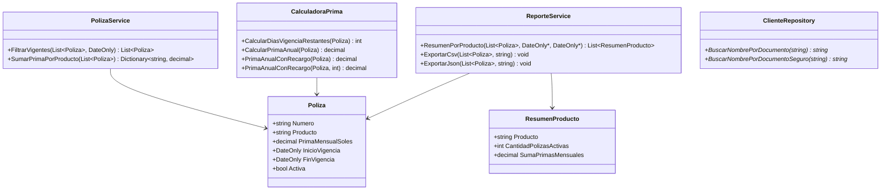

# Arquitectura - CopilotSesion1

## Diagrama de Clases

```mermaid
classDiagram
    class Poliza {
        +string Numero
        +string Producto
        +decimal PrimaMensualSoles
        +DateOnly InicioVigencia
        +DateOnly FinVigencia
        +bool Activa
    }

    class PolizaService {
        +FiltrarVigentes(List~Poliza~, DateOnly) List~Poliza~
        +SumarPrimaPorProducto(List~Poliza~) Dictionary~string, decimal~
    }

    class CalculadoraPrima {
        +CalcularDiasVigenciaRestantes(Poliza) int
        +CalcularPrimaAnual(Poliza) decimal
        +PrimaAnualConRecargo(Poliza) decimal
        +PrimaAnualConRecargo(Poliza, int) decimal
    }

    class ResumenProducto {
        +string Producto
        +int CantidadPolizasActivas
        +decimal SumaPrimasMensuales
    }

    class ReporteService {
        +ResumenPorProducto(List~Poliza~, DateOnly*, DateOnly*) List~ResumenProducto~
        +ExportarCsv(List~Poliza~, string) void
        +ExportarJson(List~Poliza~, string) void
    }

    class ClienteRepository {
        +BuscarNombrePorDocumento(string) string*
        +BuscarNombrePorDocumentoSeguro(string) string*
    }

    PolizaService --> Poliza
    CalculadoraPrima --> Poliza
    ReporteService --> Poliza
    ReporteService --> ResumenProducto
```
